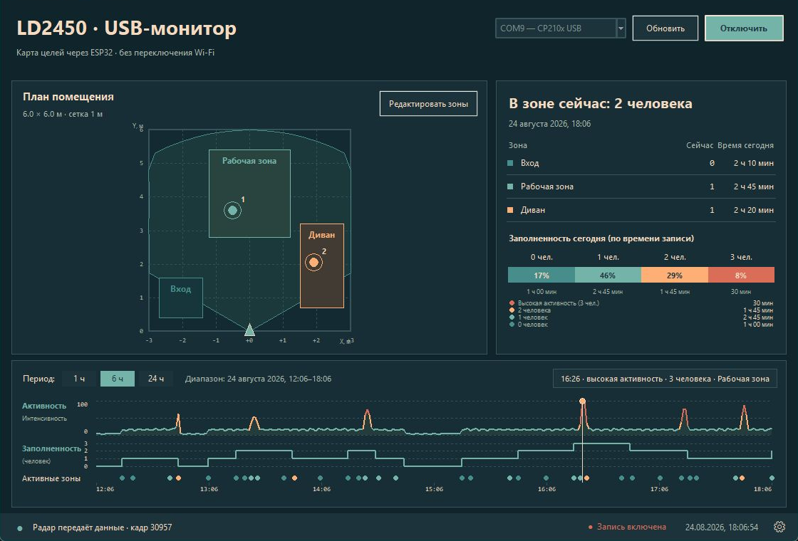

# LD2450 Radar Monitor

Локальная система мониторинга людей для радара **HLK-LD2450** и платы **ESP32 DevKit V1**. Проект показывает цели на плане помещения, считает заполненность прямоугольных зон и сохраняет историю активности — без облака и обязательного подключения к интернету.

[Скачать приложение для Windows](https://github.com/semenitto/ld2450-radar-monitor/releases/latest/download/LD2450-Monitor.exe) · [Скачать готовую прошивку](https://github.com/semenitto/ld2450-radar-monitor/releases/latest/download/ld2450_radar_esp32_complete.bin) · [Все выпуски](https://github.com/semenitto/ld2450-radar-monitor/releases)



## Возможности

- отображение до трёх целей LD2450 в реальном времени;
- квадратный план помещения с метровой сеткой;
- три редактируемые прямоугольные зоны;
- количество людей сейчас и время присутствия по зонам;
- таймлайн активности и заполненности за 1, 6 или 24 часа;
- локальная история за последние 30 дней;
- калибровка размеров помещения, позиции и поворота радара;
- отражение оси X, если лево и право перепутаны;
- сглаживание координат и гистерезис на границах зон;
- два интерфейса: веб-страница ESP32 и приложение для Windows через USB;
- автоматическое подключение к CP210x/COM-порту.

## Что понадобится

- ESP32 DevKit V1 с ESP32 и USB-C;
- HLK-LD2450;
- четыре соединительных провода;
- качественный USB-кабель с передачей данных;
- Windows 10/11 для готового настольного приложения.

Если плата не появляется как COM-порт, установите официальный [драйвер CP210x VCP от Silicon Labs](https://www.silabs.com/software-and-tools/usb-to-uart-bridge-vcp-drivers).

## Подключение

Подключайте компоненты при отключённом USB-питании. Ориентируйтесь на подписи контактов, а не на цвета проводов.

| HLK-LD2450 | ESP32 DevKit V1 | Назначение |
|---|---|---|
| `5V` | `VIN` или `5V` | питание радара от USB платы |
| `GND` | `GND` | общая земля |
| `TX` | `GPIO16` (`RX2`) | данные радара в ESP32 |
| `RX` | `GPIO17` (`TX2`) | команды ESP32 в радар |

`TX` и `RX` подключаются крест-накрест. Не питайте LD2450 от вывода `3V3`: используйте `5V`. Не подключайте одновременно два независимых источника к линии `5V/VIN`. При отдельном питании радара земли устройств должны быть объединены.

## Быстрый старт

### 1. Прошивка ESP32 готовым образом

Скачайте `ld2450_radar_esp32_complete.bin` из [последнего выпуска](https://github.com/semenitto/ld2450-radar-monitor/releases/latest) и запишите его с адреса `0x0`:

```powershell
python -m pip install esptool
python -m esptool --chip esp32 --port COM9 write_flash 0x0 ld2450_radar_esp32_complete.bin
```

Замените `COM9` на порт своей платы. Если прошивка не начинается автоматически, удерживайте кнопку `BOOT` во время подключения и отпустите после появления процесса записи.

### 2. Веб-интерфейс

После запуска ESP32 создаёт собственную точку доступа:

| Параметр | Значение |
|---|---|
| Wi-Fi | `LD2450-Radar` |
| Пароль | `radar2450` |
| Адрес | `http://192.168.4.1` |
| mDNS | `http://ld2450.local` |

Роутер и интернет не требуются. Веб-страница показывает координаты, скорость, расстояние, траектории целей и состояние UART.

### 3. Приложение для Windows по USB

1. Скачайте `LD2450-Monitor.exe` из [последнего выпуска](https://github.com/semenitto/ld2450-radar-monitor/releases/latest).
2. Подключите ESP32 к компьютеру USB-кабелем.
3. Запустите приложение.
4. Выберите COM-порт, если он не определился автоматически.
5. Нажмите «Подключить».

Wi-Fi в этом режиме не нужен. ESP32 передаёт машиночитаемые данные по USB на скорости `115200` бод, не отключая веб-интерфейс.

## Калибровка помещения

Для первой настройки достаточно рулетки:

1. Откройте шестерёнку в нижней строке приложения.
2. Укажите ширину и глубину помещения.
3. Задайте положение радара относительно центра нижней стены.
4. Укажите поворот радара; при необходимости включите отражение X.
5. Нажмите «Сохранить».
6. Включите «Редактировать зоны» и перетащите прямоугольники на нужные участки плана.

Прямоугольник перемещается целиком, а его размер меняется четырьмя угловыми маркерами. Настройки сохраняются автоматически в `%LOCALAPPDATA%\LD2450Monitor\settings.json`.

Сложная многоточечная калибровка обычно не нужна. Её имеет смысл добавлять только при устойчивой ошибке координат в разных частях помещения.

## Обработка и история данных

Координаты переводятся из системы радара в систему помещения с учётом смещения, поворота и отражения X. Затем применяется экспоненциальное сглаживание. На границах зон действует гистерезис 15 см, который уменьшает дрожание счётчиков при небольшом шуме измерений.

История хранится локально 30 дней:

```text
%LOCALAPPDATA%\LD2450Monitor\history_rect.db
```

Данные не отправляются в интернет. Проценты заполненности считаются только за фактическое время включённой записи.

## Формат USB-данных

Каждая корректная строка начинается с `LD2450_DATA`:

```text
LD2450_DATA,uptime_ms,frame,valid,x_mm,y_mm,speed_cm_s,resolution_mm,...
```

После `uptime_ms` и номера кадра следуют пять полей для каждой из трёх целей:

| Поле | Описание |
|---|---|
| `valid` | цель существует: `0` или `1` |
| `x_mm` | горизонтальная координата в миллиметрах |
| `y_mm` | расстояние вперёд в миллиметрах |
| `speed_cm_s` | радиальная скорость в сантиметрах в секунду |
| `resolution_mm` | разрешение измерения в миллиметрах |

## Сборка прошивки из исходников

Проект использует [PlatformIO и окружение `esp32dev`](https://docs.platformio.org/en/latest/boards/espressif32/esp32dev.html):

```powershell
pio run
pio run --target upload
pio device monitor
```

Если подключено несколько плат:

```powershell
pio run --target upload --upload-port COM9
```

На Windows лучше клонировать проект в короткий путь, например `C:\src\ld2450-radar-monitor`: длинные пути к пакетам ESP32 иногда превышают ограничение командной строки старого toolchain.

## Сборка Windows-приложения

Требуется Python 3.11 или новее:

```powershell
cd pc_app
python -m pip install -r requirements.txt
python -m unittest -v test_ld2450_monitor_v2.py
pyinstaller --noconfirm --clean LD2450-Monitor-v2.spec
```

Готовый файл появится в каталоге `dist` либо в пути, заданном параметрами PyInstaller.

## Структура проекта

```text
├── src/main.cpp                       прошивка ESP32 и встроенный веб-интерфейс
├── platformio.ini                     конфигурация PlatformIO
├── pc_app/ld2450_monitor_v2.py        актуальное Windows-приложение
├── pc_app/test_ld2450_monitor_v2.py   тесты обработки данных
├── pc_app/LD2450-Monitor-v2.spec      конфигурация PyInstaller
├── pc_app/requirements.txt            зависимости Python
├── audit/05-readme-interface.png      главный снимок интерфейса для README
└── design-qa.md                       результаты визуальной проверки
```

## Внешняя антенна LD2450

Внешняя антенна используется для Bluetooth-связи с мобильным приложением Hi-Link: настройки, диагностика и обновление радара. Радиолокационные антенны 24 ГГц уже выполнены на самой плате LD2450.

Для UART, USB-монитора и встроенного веб-интерфейса внешняя Bluetooth-антенна не обязательна. Без неё дальность и стабильность Bluetooth-соединения снижаются.

## Ограничения

- LD2450 передаёт не более трёх целей и не идентифицирует конкретных людей.
- Номера целей могут меняться, когда человек пропадает из поля зрения и появляется снова.
- Координаты mmWave-радара являются оценкой и зависят от установки, отражений и геометрии помещения.
- Проект предназначен для мониторинга присутствия и активности, а не для задач безопасности или медицинских измерений.

## Устранение проблем

| Проблема | Что проверить |
|---|---|
| ESP32 не видна в Windows | кабель с передачей данных, драйвер CP210x, другой USB-порт |
| «Нет данных UART» | питание 5V, общая земля, перекрёстные TX/RX, скорость LD2450 `256000` бод |
| Цели отражены слева направо | включите «Отразить X» в калибровке |
| Цели повернуты относительно комнаты | измените угол поворота радара |
| Счётчик прыгает у границы зоны | увеличьте зону или уменьшите коэффициент сглаживания |
| Приложение не подключается | закройте Serial Monitor и другие программы, занявшие COM-порт |

## Безопасность и приватность

Точка доступа использует опубликованный пароль по умолчанию `radar2450`. Для установки в общем или публичном пространстве измените `AP_PASSWORD` в `src/main.cpp` и пересоберите прошивку.

Веб-интерфейс доступен только в локальной сети ESP32. Настройки помещения, история присутствия и координаты целей остаются на компьютере пользователя.

## Обратная связь

Сообщения об ошибках и предложения можно оставлять в [GitHub Issues](https://github.com/semenitto/ld2450-radar-monitor/issues). Перед созданием issue укажите модель ESP32, номер COM-порта, способ питания радара и приложите описание ожидаемого и фактического поведения.
